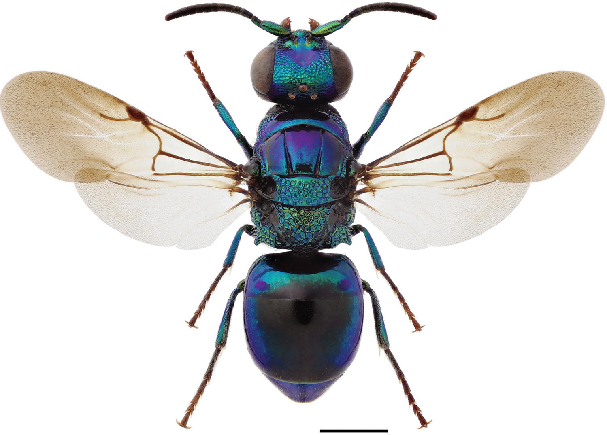

<h1 align="center" style="font-size: 50px;"><b>G-WASPiper</b></h1>

    

  <small>Source of photo: <a href="https://doi.org/10.3897/zookeys.548.6164">DOI Link</a></small>

# G-WASPiper
* A handy pipeline for GWAS/genotyping data analysis.
* It can be easly used without having coding skills.
* Each pipelines are general indipentent , and can be highly modified by changing `R scripts`.

## Main Functions and Scripts
- all main function will be added here in text and table!!!

## Short description and main usage

### What is G-WASPiper?
+ This repository is my collection of pipelines written in R to simplify, please cite original tools/approaches referred in the pipelines. The main idea here is putting every step in a pipe to ensure repredociblity and simplyfy all process. 
+ The pipeline designed to start from raw genotyping results to create QCed Genotype Data / Ancestery inference / GWAS / TWAS / PRS / MR / xQTL / GWIS / FINE mapping / and many more (will be updated) analysis.
+ The main idea here creating standart pipeline for all process by using different approaches/packages/softwares.
+ It is my personal reposotry to keep track all pipeline that I am using.
+ Of course anyone can used as it or with modifaction.
+ I will acknowledge any resourse/pipeline/code inclueded this codes.

 ### What is ***NOT*** G-WASPiper?
 + It is ***not*** automatic pipeline or click and run pipeline!
 + It is ***not*** software / package / container. I know there are some R packages or nextflow version that similar with G-WASPiper. But, here idea is creating more flexible and modifiable pipeline that you have control at each step.
 + You need to modify some arguments (MAF, INFO, HWE, p value etc.) in the codes, so please be carefull before running any pipeline.
 + Some steps and pipelines are need strong computational resources and running this process with out any paralellization/optimization will cost you a lot of time.
 + If you have access  to any HPC, please run this analysis in side to HPC. The pipelines not optimazated for parallel work.
 + It is not a novel package/software, published work. I will try to answer/fix any question/bug, but it would be regulary basic.

### How frequently it will updated?
+ The pipelines will backed-up for each major update. So, anyone can access previous versions.
+ Update doesn`t mean changing everything or every pipeline, it usually will be adding more method/script.
+ The major updates/adding features will be recorded <a href= "https://github.com/biomguler/G-WASPiper/wiki">[wiki page.](#)
+ Frequency of the updates will be related request/issue number and personal time.

### License for G-WASPiper and other Softwares 

+ `G-WASPiper` is distributed under [an MIT license](https://github.com/biomguler/G-WASPiper/blob/main/LICENSE). So, it means you can do nearly everything with this pipelines. 
+ But, please cite the ***orginal*** works/software when you use any pipeline depents on the software/package below. 
+ If you used `G-WASPiper` in your works please look `How to cite` section below.
  

| Software | Link                   | PMID                                    |
|----------|------------------------|-------------------------------------------------|
| Plink1.9   | [Link to Tool A](#)   | [Publication A](#)                              |
| Plink2.0   | [Link to Tool B](#)   | [Publication B](#)                              |
| vcftools/0.1.16   | [Link to Tool C](#)   | [Publication C](#)                              |
| htslib/1.8   | [Link to Tool C](#)   | [Publication C](#)                              |
| bcftools/1.9   | [Link to Tool C](#)   | [Publication C](#)                              |
| anaconda3/2021.05   | [Link to Tool C](#)   | [Publication C](#)                              |
| fraposa  | [Link to Tool C](#)   | [Publication C](#)                              |
| tidyverse (R) | [Link to Tool C](#)   | [Publication C](#)                              |

## Step-by-step G-WASPiper
- Full documentation is available at: <a href="https://github.com/biomguler/G-WASPiper/wiki">[https://github.com/biomguler/G-WASPiper/wiki](#)

# Sources

<b>Some of the pipelines modified from:</b>

* Marees, A. T., de Kluiver, H., Stringer, S., Vorspan, F., Curis, E., Marie‐Claire, C., & Derks, E. M. (2018). A tutorial on conducting genome‐wide association studies: Quality control and statistical analysis. International journal of methods in psychiatric research, 27(2), e1608.

## How to cite
* will be updated 

## Sample Data
* will be updated 

## Contacts
* Github:
    - [https://github.com/biomguler/G-WASPiper/issues](https://github.com/biomguler/G-WASPiper/issues)
* Email:
    - [murat.guler@dkfz.de](murat.guler@dkfz.de)
    - [muratgmbg@gmail.com](muratgmbg@gmail.com)
